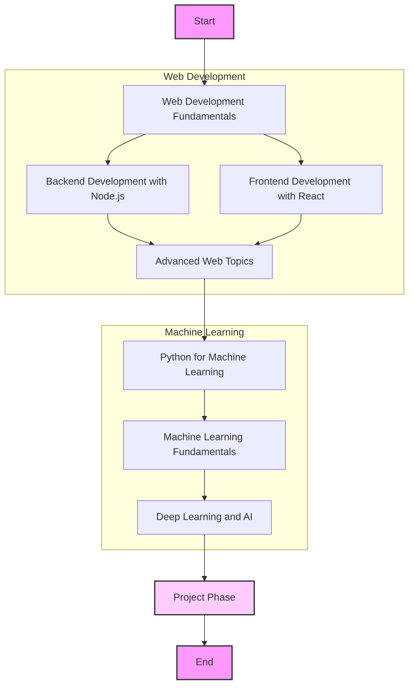

```mermaid
graph TD
    A[Start] --> B[Web Development Fundamentals]
    B --> C[Backend Development with Node.js]
    B --> D[Frontend Development with React]
    C --> E[Advanced Web Topics]
    D --> E
    E --> F[Python for Machine Learning]
    F --> G[Machine Learning Fundamentals]
    G --> H[Deep Learning and AI]
    H --> I[Project Phase]
    I --> J[End]

    subgraph "Web Development"
    B
    C
    D
    E
    end

    subgraph "Machine Learning"
    F
    G
    H
    end

    style A fill:#f9f,stroke:#333,stroke-width:2px
    style J fill:#f9f,stroke:#333,stroke-width:2px
    style I fill:#fcf,stroke:#333,stroke-width:2px
```
