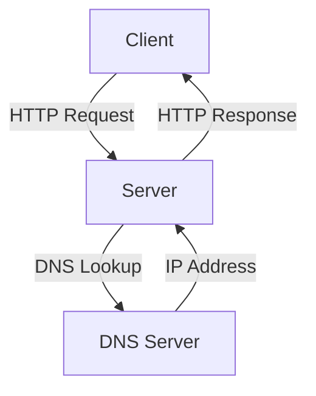
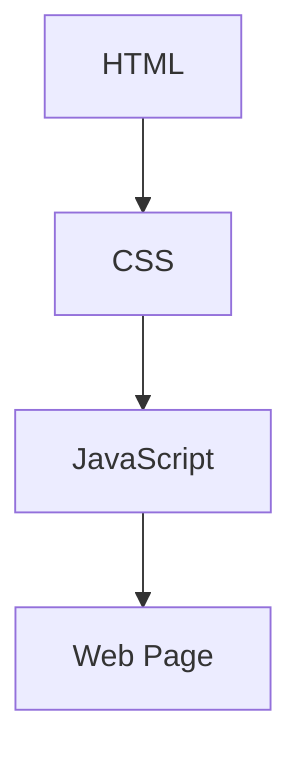
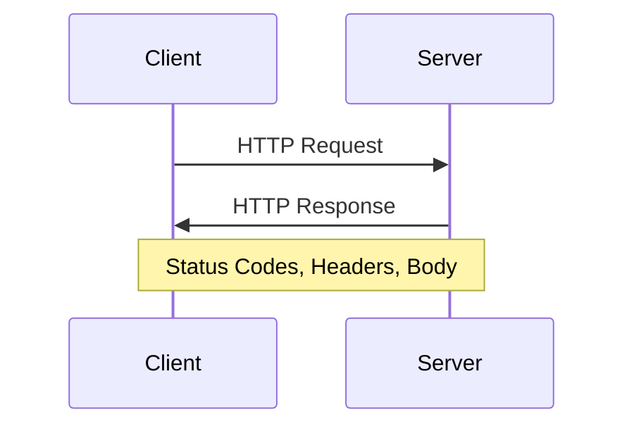
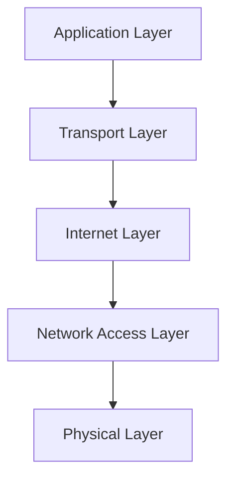
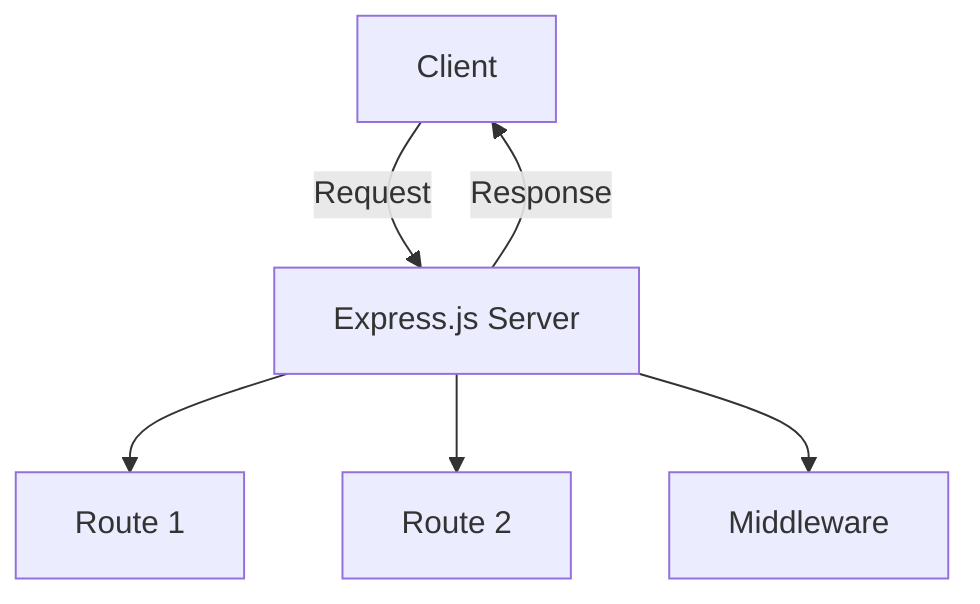
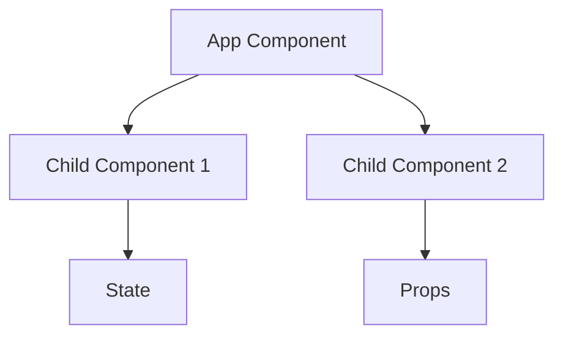
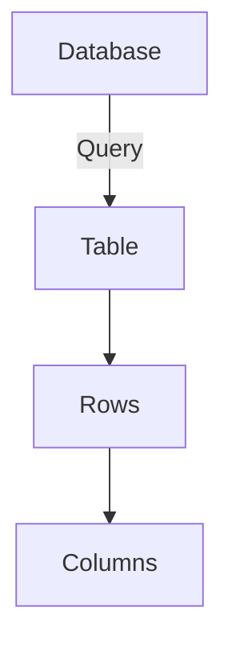
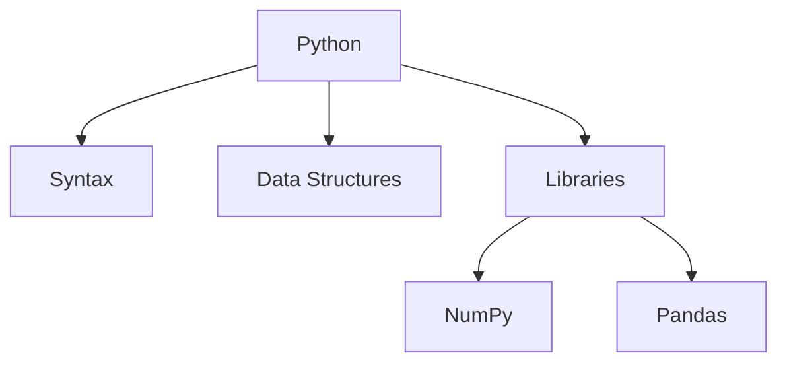
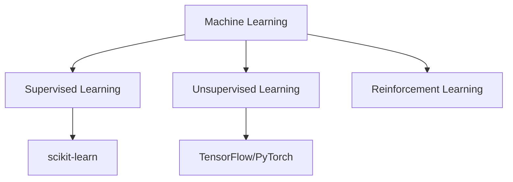
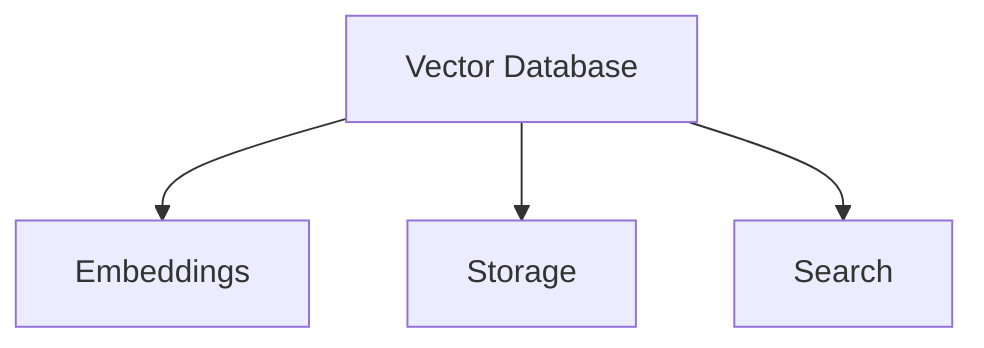

Certainly! Below is the study plan and roadmap, structured and formatted for Obsidian, with diagrams where necessary.

### Obsidian Study Plan and Roadmap

#### 1. Internet and Networking Basics
**Topics to Learn**: IP Addresses, DNS, Client-Server Model
- **Resources**:
  - [How the Internet Works in 5 Minutes by Aaron Maxwell](https://www.youtube.com/watch?v=7_LPdttKXPc)
  - [Networking 101 by Eli the Computer Guy](https://www.youtube.com/watch?v=5o8CwafCxnU)
  - [How the Web Works by Mozilla](https://developer.mozilla.org/en-US/docs/Learn/Getting_started_with_the_web/How_the_Web_works)
  - *Computer Networking: A Top-Down Approach* by James Kurose and Keith Ross
  - [Computer Networks by Stanford University](https://online.stanford.edu/courses/soe-ycscompn1-computer-networking)

**Diagram**: 

#### 2. Web Development Fundamentals
**Topics to Learn**: HTML, CSS, JavaScript
- **Resources**:
  - [HTML and CSS Crash Course on Traversy Media](https://www.youtube.com/watch?v=UB1O30fR-EE)
  - [JavaScript Crash Course on Traversy Media](https://www.youtube.com/watch?v=hdI2bqOjy3c)
  - [FreeCodeCamp HTML and CSS](https://www.freecodecamp.org/learn/responsive-web-design/)
  - *HTML and CSS: Design and Build Websites* by Jon Duckett
  - [JavaScript.info](https://javascript.info/)
  - *Eloquent JavaScript* by Marijn Haverbeke
  - [MDN Web Docs on JavaScript](https://developer.mozilla.org/en-US/docs/Web/JavaScript)

**Diagram**:

#### 3. HTTP/HTTPS Protocol
**Topics to Learn**: HTTP Requests and Responses, Status Codes, HTTPS
- **Resources**:
  - [HTTP: The Protocol Every Web Developer Must Know - Part 1](https://medium.com/better-programming/http-the-protocol-every-web-developer-must-know-part-1-8643dbe2a1a4)
  - [MDN Web Docs on HTTP](https://developer.mozilla.org/en-US/docs/Web/HTTP)
  - *HTTP: The Definitive Guide* by David Gourley and Brian Totty
  - [Web Application Security on Coursera](https://www.coursera.org/learn/web-app-security)

**Diagram**:

#### 4. TCP/IP Model and Networking
**Topics to Learn**: TCP/IP Layers, TCP Three-Way Handshake, DNS Resolution Process
- **Resources**:
  - [Networking 101 by Eli the Computer Guy](https://www.youtube.com/watch?v=5o8CwafCxnU)
  - [What Happens When You Type a URL into Your Browser and Press Enter?](https://medium.com/@maneesha.wijesinghe/what-happens-when-you-type-a-url-into-the-browser-and-hit-enter-c16d2adcb8d8)
  - *Computer Networking: A Top-Down Approach* by James Kurose and Keith Ross
  - [Computer Networking: Principles, Protocols and Practice](https://www.coursera.org/learn/computer-networking)

**Diagram**:

#### 5. Express.js (Web Server)
**Topics to Learn**: Setting up a server, Routing, Middleware
- **Resources**:
  - [Express.js Official Documentation](https://expressjs.com/)
  - [Express.js Crash Course on Traversy Media](https://www.youtube.com/watch?v=L72fhGm1tfE)
  - [The Complete Node.js Developer Course (3rd Edition)](https://www.udemy.com/course/the-complete-nodejs-developer-course-2/)
  - [Getting Started with Express](https://developer.mozilla.org/en-US/docs/Learn/Server-side/Express_Nodejs/Introduction)

**Diagram**:

#### 6. React (Single Page Application Framework)
**Topics to Learn**: Components, State and Props, Lifecycle Methods, Hooks
- **Resources**:
  - [React Official Tutorial](https://reactjs.org/tutorial/tutorial.html)
  - [React Crash Course on Traversy Media](https://www.youtube.com/watch?v=sBws8MSXN7A)
  - [React - The Complete Guide (incl Hooks, React Router, Redux)](https://www.udemy.com/course/react-the-complete-guide-incl-redux/)
  - *Learning React* by Alex Banks and Eve Porcello

**Diagram**:

#### 7. SQL
**Topics to Learn**: SELECT, WHERE, Aggregation, Data Modeling, Normalization Forms
- **Resources**:
  - [SQLBolt](https://sqlbolt.com/)
  - [SQL Tutorial - Full Database Course for Beginners](https://www.youtube.com/watch?v=HXV3zeQKqGY)
  - [The Complete SQL Bootcamp 2020: Go from Zero to Hero](https://www.udemy.com/course/the-complete-sql-bootcamp/)
  - *SQL for Data Scientists* by Renee M. P. Teate

**Diagram**:

#### 8. Python
**Topics to Learn**: Basic Syntax, Data Structures, Libraries (NumPy, Pandas)
- **Resources**:
  - [Python.org](https://www.python.org/about/gettingstarted/)
  - [Python Crash Course for Beginners on Traversy Media](https://www.youtube.com/watch?v=JJmcL1N2KQs)
  - [Complete Python Bootcamp: Go from zero to hero in Python 3](https://www.udemy.com/course/complete-python-bootcamp/)
  - *Automate the Boring Stuff with Python* by Al Sweigart

**Diagram**:

#### 9. Machine Learning
**Topics to Learn**: Basics of Machine Learning, Libraries (scikit-learn, TensorFlow/PyTorch)
- **Resources**:
  - [Andrew Ng's Machine Learning Course](https://www.coursera.org/learn/machine-learning)
  - [Machine Learning with Python on freeCodeCamp](https://www.youtube.com/watch?v=Gv9_4yMHFhI)
  - *Hands-On Machine Learning with Scikit-Learn, Keras, and TensorFlow* by Aurélien Géron
  - [Deep Learning Specialization by Andrew Ng](https://www.coursera.org/specializations/deep-learning)

**Diagram**:

#### 10. Vector Databases
**Topics to Learn**: Basics of Vector Databases, Embeddings
- **Resources**:
  - [Introduction to Vector Databases](https://towardsdatascience.com/a-simple-introduction-to-vector-databases-65fd5bc53a39)
  - [Pinecone Documentation](https://docs.pinecone.io/docs)
  - [Vector Databases Explained](https://www.youtube.com/watch?v=qxH4xgOP4_0)

**Diagram**:

### Project Development Phases

#### Phase 1: Backend Development with Node.js and Express
- Setup server and basic routing
- Implement user accounts and social features
- Integrate fuzzy/n-gram search if transcription is used

#### Phase 2: AI Engine Development
- Implement vector database integration
- Setup transcription using OpenAI API or similar service
- Develop custom

 models in Python and expose via REST API using Flask

#### Phase 3: Frontend Development with React
- Design and develop frontend components
- Integrate backend APIs with the frontend
- Implement user authentication and search functionalities

### Study Schedule Example

**Week 1-2**: Internet and Networking Basics
- Learn about IP addresses, DNS, client-server model
- Study the TCP/IP model and networking

**Week 3-4**: Web Development Fundamentals
- HTML, CSS, and JavaScript

**Week 5-6**: HTTP/HTTPS Protocol
- HTTP requests and responses, status codes, and HTTPS

**Week 7-8**: Express.js
- Setting up your server and routing

**Week 9-10**: React
- Creating frontend components

**Week 11-12**: SQL
- Practice with real-world examples

**Week 13-14**: Python
- Basic syntax and libraries

**Week 15-16**: Machine Learning
- Basics and advanced concepts

**Week 17-18**: Vector Databases
- Vector databases and embeddings
- Integration with your project

### Continuous Learning and Practice
- Work on your project iteratively, applying what you learn in each phase.
- Regularly review and practice previous topics to solidify your knowledge.

This study plan and roadmap should help you keep track of your progress and provide a clear path forward. If you need further details or have specific questions, feel free to ask!