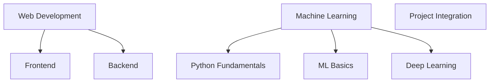

# Web Development and Machine Learning Study Plan

## Overview

This study plan covers both web development and machine learning, divided into distinct stacks. Each section includes resources and key topics to focus on.

## Web Development Stack

### Frontend Development
![[Frontend]]

> [!info] Focus Areas
> - HTML, CSS, JavaScript
> - React
> - State Management
> - API Integration

#### Resources
- Course: "React - The Complete Guide" by Maximilian Schwarzmüller (Udemy)
- Book: "You Don't Know JS" series by Kyle Simpson
- Documentation: [Official React docs](https://reactjs.org/docs/getting-started.html)

#### Timeline
- Weeks 1-4: HTML, CSS, JavaScript basics
- Weeks 5-8: React fundamentals
- Weeks 9-12: Advanced React and state management

### Backend Development
![[Backend]]

> [!info] Focus Areas
> - Node.js and Express
> - RESTful API design
> - Database integration (focus on vector databases)
> - Authentication and authorization

#### Resources
- Course: "Node.js, Express, MongoDB & More: The Complete Bootcamp" by Jonas Schmedtmann (Udemy)
- Documentation: [Official Node.js docs](https://nodejs.org/en/docs/)
- Documentation: [Express.js docs](https://expressjs.com/)

#### Timeline
- Weeks 1-3: Node.js basics
- Weeks 4-6: Express.js and RESTful API design
- Weeks 7-9: Database integration and vector databases
- Weeks 10-12: Authentication, authorization, and advanced topics

## Machine Learning Stack

### Python for Machine Learning
![[Python_ML]]

> [!info] Focus Areas
> - Python basics
> - NumPy and Pandas for data manipulation
> - Data visualization with Matplotlib and Seaborn

#### Resources
- Course: "Python for Data Science and Machine Learning Bootcamp" by Jose Portilla (Udemy)
- Book: "Python for Data Analysis" by Wes McKinney

#### Timeline
- Weeks 1-3: Python basics
- Weeks 4-6: NumPy and Pandas
- Weeks 7-8: Data visualization

### Machine Learning Fundamentals
![[ML_Fundamentals]]

> [!info] Focus Areas
> - ML algorithms and concepts
> - Scikit-learn library
> - Model evaluation and validation
> - Natural Language Processing basics

#### Resources
- Course: "Machine Learning" by Andrew Ng (Coursera)
- Book: "Hands-On Machine Learning with Scikit-Learn, Keras, and TensorFlow" by Aurélien Géron

#### Timeline
- Weeks 1-4: ML concepts and algorithms
- Weeks 5-8: Scikit-learn and model evaluation
- Weeks 9-12: NLP basics and advanced topics

### Deep Learning
![[Deep_Learning]]

> [!info] Focus Areas
> - Neural network fundamentals
> - Deep learning frameworks (TensorFlow or PyTorch)
> - Convolutional and Recurrent Neural Networks
> - Transfer learning

#### Resources
- Course: "Deep Learning Specialization" by Andrew Ng (Coursera)
- Book: "Deep Learning" by Ian Goodfellow, Yoshua Bengio, and Aaron Courville

#### Timeline
- Weeks 1-4: Neural network basics
- Weeks 5-8: CNN and RNN architectures
- Weeks 9-12: Advanced topics and transfer learning

## Project Integration
![[Project_Integration]]

> [!tip] Final Project
> Combine your web development and machine learning skills to create a full-stack application with AI features.

### Project Ideas
1. Intelligent Content Recommendation System
2. Real-time Image Classification Web App
3. Natural Language Processing Chatbot
4. Predictive Analytics Dashboard

### Timeline
- Weeks 1-2: Project planning and design
- Weeks 3-6: Backend development and ML model integration
- Weeks 7-10: Frontend development and UI/UX
- Weeks 11-12: Testing, optimization, and deployment

---

Remember to adjust this timeline based on your learning pace and prior knowledge. Regular coding practice and building small projects throughout your learning journey will reinforce your skills. Good luck with your studies!