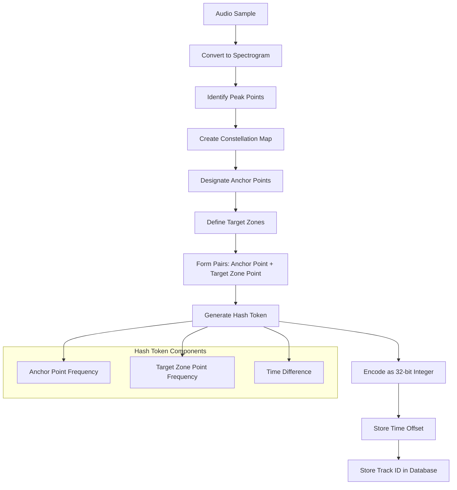

```mermaid
graph TD
    A[Audio Sample] --> B[Convert to Spectrogram]
    B --> C[Identify Peak Points]
    C --> D[Create Constellation Map]
    D --> E[Designate Anchor Points]
    E --> F[Define Target Zones]
    F --> G[Form Pairs: Anchor Point + Target Zone Point]
    G --> H[Generate Hash Token]
    H --> I[Encode as 32-bit Integer]
    I --> J[Store Time Offset]
    J --> K[Store Track ID in Database]

    subgraph Hash Token Components
    H1[Anchor Point Frequency]
    H2[Target Zone Point Frequency]
    H3[Time Difference]
    end

    H --> H1
    H --> H2
    H --> H3
```

