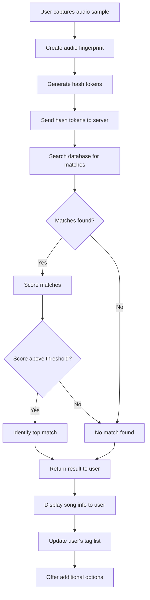

```mermaid
graph TD
    A[User captures audio sample] --> B[Create audio fingerprint]
    B --> C[Generate hash tokens]
    C --> D[Send hash tokens to server]
    D --> E[Search database for matches]
    E --> F{Matches found?}
    F -->|Yes| G[Score matches]
    F -->|No| K[No match found]
    G --> H{Score above threshold?}
    H -->|Yes| I[Identify top match]
    H -->|No| K
    I --> J[Return result to user]
    K --> J
    J --> L[Display song info to user]
    L --> M[Update user's tag list]
    M --> N[Offer additional options]
```

