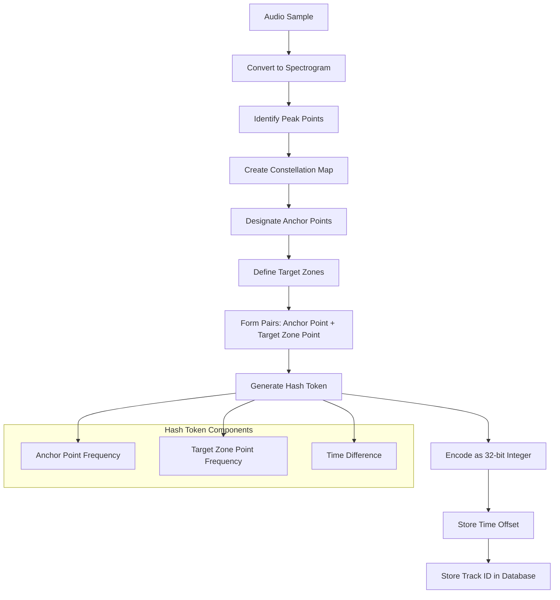

# Shazam Hash Token Generation Process

The Shazam algorithm generates hash tokens from audio samples using the following process:

1. Spectrogram Analysis:
   - The audio sample is converted into a spectrogram, which is a visual representation of the frequencies present in the audio over time.

2. Peak Extraction:
   - The algorithm identifies peak points in the spectrogram. These are points with higher energy content than their surrounding neighbors.
   - These peaks form what the paper calls a "constellation map" of the audio.

3. Anchor Points:
   - Some of these peak points are designated as "anchor points".

4. Target Zones:
   - For each anchor point, a "target zone" is defined. This is a region of the spectrogram that comes after the anchor point in time.

5. Pair Formation:
   - The algorithm then forms pairs between each anchor point and the points within its target zone.

6. Hash Generation:
   - For each pair, a hash token is created. This hash includes:
     a. The frequency of the anchor point
     b. The frequency of the target zone point
     c. The time difference between the anchor point and the target zone point

7. Encoding:
   - These three pieces of information (two frequencies and one time difference) are encoded into a 32-bit integer, which becomes the hash token.

8. Additional Information:
   - Along with each hash, the algorithm stores the time offset of the anchor point from the beginning of the audio file.
   - In the database, it also stores the track ID associated with each hash.

This process creates a set of hash tokens that are highly characteristic of the audio sample, yet resilient to various forms of noise and distortion. These tokens can then be quickly matched against a large database of pre-computed tokens from known songs.

## Diagram: Hash Token Generation Process

    